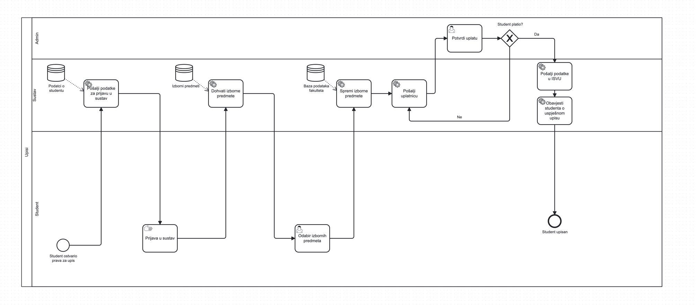

BPMN Model za upis studenata na fakultet

## Opis procesa

Ovaj dijagram prikazuje proces upisa studenta na fakultet kroz nekoliko koraka.Proces započinje tako da naš sustav zaprimi event
od "postani student" sa podacima o studentu (ime, prezime, email, željeni fakultet, itd.).
Student koji je ostvario prava za upis pristupa sustavu dobije svoj email i password te
se prijavljuje. 

Nakon prijave, sustav šalje podatke o studentu kako bi se zabilježili u
bazi podataka, a student zatim bira izborne predmete. Sustav automatski dohvaća
dostupne izborne predmete iz baze podataka i prikazuje ih studentu na izbor. 

Nakon
odabira predmeta, sustav sprema odabrane predmete i generira uplatnicu koju šalje
studentu. Ako student nije izvršio uplatu, proces se zaustavlja dok se uplata ne
potvrdi. Kada je uplata potvrđena, podaci se šalju u ISVU, a student dobiva obavijest o uspješnom upisu. Proces završava kada je student
uspješno upisan, što je označeno završnim stanjem na dijagramu.

## Tehnologije
- Camunda BPMN
- JS
- SQLite
- Docker 

## Upute za pokretanje

Pokrenuti run.sh

## Opis koda

Kod je pisan u JS-u, te se pokreće s naredbom `node <naziv_datoteke>`.
Biblioteke koje se koriste su :

- `fs` za rad s datotekama
- `axios` za slanje zahtjeva na BPMN Rest API
- `camunda-external-task-client-js` za postavljanj worker-a
- `sqlite3` za rad s bazom podataka gdje spremamo podatke o studentima

### setup.db.js

Potrebno pokrenuti kako bi se postavile tablice u bazi podataka, te dodali početni (seed) podaci.

### create.groups.js

Kreiranje grupa za studente, te postavljanje permissiona kako bi student mogako pristupiti tasklist applicationu na
Camundi.

### deploy.js

Deploya datoteke: `upisi.bpmn`, `odabirpredmeta.form`, `studentplatio.form` na Camundu pokrenutu na Dockeru.
Koristi Rest API za deployanje.

Nakon uspješnog deploya se pokreče process sa početnom process varijablom `student_contact_email:leo.radocaj2@gmail.com`.

### workers.js

#### send-credentials
Koristi se za kreiranje korisničkog računa unutar Camunde, te ga dodaje u grupu "students".
U konzoli se ispisuje lozinka za taj račun.

#### get-courses
Povlači sve dostupne izborne predmete za faks na koji se student upisuje, te ih postavlja kao process varijablu.

#### save-courses
Nakon što student odabere predmete na Tasklistu, ovaj worker ih sprema u bazu podataka.

### send-invoice
Ovaj worker bi trebao slati mail studentu s računom za upis, no trenutno je samo simulacija.
Obzirom da JS SDK nema support sa Send i Receive Taskove, nije moguće simulirati event o uspješnom plaćanju računa, stoga sam napravio posebnu formu gdje će admin manualno potvrditi uplatu.

### isvu-send
Postavlja u bazi podataka da je student upisan, te šalje zahtjev na ISVU za upis studenta.

### student-enrolled
Obavještava studenta da je uspješno upisan na faks.